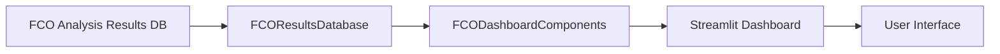

# FCO Dashboard Requirements Document

## 📋 概要

FCOダッシュボードは、DS-LPPLS ConfidenceとTrust指標を中心とした包括的な市場分析インターフェースを提供します。既存のLPPLダッシュボードの機能をFCO用に適応させ、R²メトリックをDS-LPPLS Confidenceに置き換えます。

## 🎯 主要目標

1. **FCO分析結果の可視化**: DS-LPPLS Confidence/Trustによるバブル検出
2. **時系列分析**: 複数期間での予測推移の追跡
3. **予測クラスタリング**: 類似予測のグループ化と信頼性評価
4. **投資判断支援**: データに基づく客観的な分析結果提供

## 📊 タブ構成

### 1. Overview & Screening タブ（最優先実装）

#### 目的
FCO分析の概要表示と複数銘柄のスクリーニング機能

#### 主要コンポーネント

##### A. 期間選択機能
```
📅 Analysis Data Period
- From: [日付選択]（デフォルト: 最古の分析日）
- To: [日付選択]（デフォルト: 最新の分析日）
- 選択期間の視覚表示（プログレスバー）
```

##### B. Crash Prediction Data プロット
- **X軸**: 分析基準日（analysis_basis_date）
- **Y軸**: 予測クラッシュ日（predicted_crash_date）
- **色分け**: DS-LPPLS Confidence値（0-100%のグラデーション）
- **ホバー情報**:
  - DS-LPPLS Confidence値
  - DS-LPPLS Trust値
  - バブルタイプ（positive/negative）
  - 基準日からの日数
  - ウィンドウ適合率

##### C. メトリック表示
```
📊 最新分析結果
- DS-LPPLS Confidence（正）: XX.X%
- DS-LPPLS Confidence（負）: XX.X%
- DS-LPPLS Trust: XX.X%
- バブル判定: 🔴/🔵/🟡/⚪
```

##### D. 詳細情報エクスパンダー
```
📊 FCO分析詳細
- 分析情報:
  - 分析基準日
  - データソース
  - データ期間
  - データポイント数
- 窓分析結果:
  - 分析窓数（126）
  - 適合窓数
  - 予測tc（中央値）
  - 標準偏差
```

### 2. Window Analysis タブ

#### 目的
126ウィンドウの分析結果詳細表示

#### 主要コンポーネント

##### A. ウィンドウ分布ヒストグラム
- tc値の分布（適合窓のみ）
- 中央値表示
- 標準偏差表示

##### B. ウィンドウテーブル
```
| Window# | Start | End | Days | tc | R² | Damping | m | ω | Status |
|---------|-------|-----|------|----|----|---------|---|---|--------|
```

### 3. Time Series タブ

#### 目的
DS-LPPLS Confidence/Trustの時系列推移

#### 主要コンポーネント

##### A. Confidence推移グラフ
- X軸: 分析基準日
- Y軸: DS-LPPLS Confidence (%)
- 2系列: Positive Bubble, Negative Bubble
- 30%閾値ライン表示

##### B. Trust推移グラフ
- X軸: 分析基準日
- Y軸: DS-LPPLS Trust (%)
- 信頼区間表示

### 4. Clustering Analysis タブ

#### 目的
予測クラッシュ日のクラスタリング分析（DS-LPPLS Confidence重み付き）

#### 主要コンポーネント

##### A. パラメータ設定
- Clustering Distance: 10-90日
- Min Cluster Size: 2-10
- Min DS-LPPLS Confidence: 0-100%

##### B. 2D散布図
- Confidence重み付きクラスター中心線
- 色分けされたクラスター
- 参照線表示

##### C. 統計テーブル
```
| Cluster | Center Date | Size | Avg Confidence | Trust | Reliability |
|---------|-------------|------|----------------|-------|-------------|
```

## 🔄 データフロー



## 📦 実装要件

### データベース連携
- `FCOResultsDatabase`からのデータ取得
- `fco_analysis`テーブル: 基本分析結果
- `fco_window_fits`テーブル: ウィンドウ詳細
- `fco_confidence_history`テーブル: 時系列データ

### 表示要件
- **DS-LPPLS Confidence優先**: R²の代わりにConfidence表示
- **Trust指標表示**: ブートストラップ法による信頼性
- **バブルタイプ表示**: positive/negative/weak/none
- **期間フィルタリング**: 分析基準日ベース

### パフォーマンス要件
- キャッシュ活用（session_state）
- 遅延読み込み（必要時のみDB接続）
- 効率的なクエリ（インデックス活用）

## 🚀 実装優先順位

1. **Phase 1**: Overview & Screening タブ（基本機能）
   - 期間選択機能
   - Crash Prediction Dataプロット
   - DS-LPPLS Confidence表示

2. **Phase 2**: データ品質向上
   - Trust指標の統合
   - ホバー情報の充実
   - エラーハンドリング

3. **Phase 3**: 追加タブ実装
   - Window Analysis
   - Time Series
   - Clustering Analysis

## ⚠️ 注意事項

### LPPLダッシュボードとの差異
- **メトリック**: R² → DS-LPPLS Confidence
- **閾値**: R² > 0.8 → DS-LPPLS Confidence > 30%
- **ウィンドウ数**: 1-5 → 126固定
- **データソース**: 2年キャッシュ → 全履歴キャッシュ

### 法的コンプライアンス
- 「クラッシュ予測」の直接的表現を避ける
- 数値データのみ提供（投資判断を含まない）
- ユーザーが追加分析を行う設計

## 📐 UI/UXガイドライン

### 色使い
- Positive Bubble: 赤系（#FF4444）
- Negative Bubble: 青系（#4444FF）
- Weak Signal: 黄系（#FFFF44）
- No Bubble: 灰系（#AAAAAA）

### レイアウト
- サイドバー: 銘柄選択、フィルター設定
- メインエリア: タブ切り替え、グラフ表示
- メトリック: 3カラムレイアウト

### インタラクション
- ホバーで詳細情報表示
- クリックで詳細ビュー展開
- ドラッグで期間選択

## 🔧 技術スタック

- **Frontend**: Streamlit
- **Visualization**: Plotly
- **Data Processing**: Pandas, NumPy
- **Database**: SQLite（FCO専用DB）
- **Caching**: Streamlit session_state

## 📝 成功基準

1. DS-LPPLS Confidenceの正確な表示
2. 期間選択による動的フィルタリング
3. 高速なレスポンス（<1秒）
4. 直感的なUI/UX
5. FCO/LPPL完全分離の維持