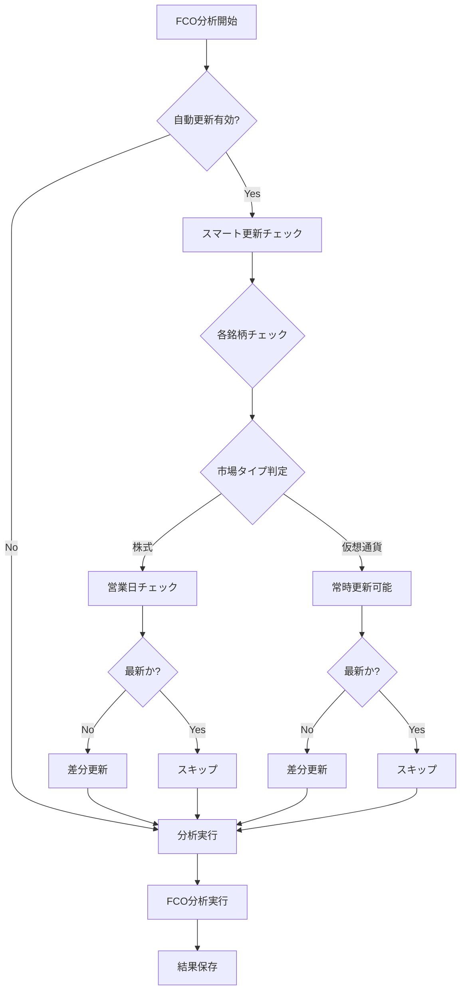

# FCO V3 完全アーキテクチャ仕様書

## 📊 バージョン履歴

- **V1**: 旧実装（API直接呼び出し、2年データ）
- **V2**: 全履歴キャッシュ専用（API非依存）
- **V3**: スマート更新機能統合（市場休業日対応） ← **現在**

## 🎯 FCO V3の主要機能

### 1. 全履歴キャッシュ専用アーキテクチャ
- FCOシステムは全履歴データ（最大40年）のみを使用
- LPPLシステム（2年データ）とは完全分離
- ローカルキャッシュからの高速読み込み（<3ms）

### 2. スマート更新システム
- **市場休業日の自動判定**
  - 株式市場：土日休業を認識
  - 仮想通貨：24/7取引として扱う
- **差分更新の最適化**
  - 既存データの最終日から更新
  - 不要なAPI呼び出しを削減
- **時差対応**
  - 米国市場の時差を考慮
  - 日本時間朝6時前は前日扱い

### 3. リトライ機能
- 最大3回の自動リトライ
- 指数バックオフ（1秒→3秒→5秒）
- 失敗銘柄の個別再試行サポート

## 📁 システム構成

```
applications/analysis_tools/
├── fco_daily_analyzer.py          # FCO分析器（全履歴専用）
├── fco_daily_scheduler_v3.py      # V3スケジューラー（スマート更新付き）
└── archive/
    ├── fco_historical_analyzer.py.archived  # 旧実装
    └── fco_daily_scheduler_v2.py           # V2実装（参考用）

infrastructure/market_data/
├── data_downloader.py              # 基本ダウンローダー
├── smart_data_updater.py           # スマート更新エンジン
└── cache/
    ├── full/                       # FCO用全履歴キャッシュ
    └── prepared/                   # LPPL用2年キャッシュ

entry_points/
└── main.py                         # 統一エントリーポイント（V3統合済み）
```

## 🚀 使用方法

### 基本コマンド

```bash
# FCO日次分析（自動更新付き）
python entry_points/main.py fco-daily run

# データ更新のみ
python entry_points/main.py fco-daily update

# 失敗した更新の再試行
python entry_points/main.py fco-daily retry

# データ鮮度確認
python entry_points/main.py fco-daily check

# システム状態確認
python entry_points/main.py fco-daily status
```

### オプション

```bash
# 更新をスキップして分析
python entry_points/main.py fco-daily run --skip-update

# 特定銘柄のみ処理
python entry_points/main.py fco-daily run --symbols SP500 BTC
python entry_points/main.py fco-daily update --symbols NASDAQCOM
```

## 🔄 データ更新フロー



## 📊 市場タイプ定義

| 市場タイプ | 銘柄例 | 営業時間 | 休業日 |
|-----------|--------|----------|--------|
| **STOCK** | SP500, NASDAQCOM, DJIA | 平日のみ | 土日・祝日 |
| **CRYPTO** | BTC, ETH, BNB | 24/7 | なし |

## 🎯 パフォーマンス指標

| 操作 | 時間 | 備考 |
|------|------|------|
| キャッシュ読み込み | <3ms | Parquet形式 |
| 更新チェック | <100ms | ローカルファイルシステム |
| 差分更新（1銘柄） | 1-3秒 | API呼び出し含む |
| FCO分析（126窓） | 1-3分 | 銘柄により変動 |

## 📋 運用推奨設定

### Cronジョブ

```bash
# 株式市場メイン（平日のみ）
0 6 * * 1-5 cd /path/to/project && python entry_points/main.py fco-daily run

# 仮想通貨も含む（毎日）
0 6 * * * cd /path/to/project && python entry_points/main.py fco-daily run
```

### 環境変数

```bash
# .env ファイル
FRED_API_KEY=your_fred_api_key
ALPHA_VANTAGE_KEY=your_alpha_vantage_key
COINGECKO_API_KEY=your_coingecko_api_key  # オプション
TWELVE_DATA_API_KEY=your_twelve_data_key   # オプション
```

## ✅ 実装完了機能

- [x] 全履歴キャッシュ専用アーキテクチャ
- [x] FCO/LPPL完全分離
- [x] スマート更新（市場休業日対応）
- [x] 差分更新の最適化
- [x] リトライ機能（指数バックオフ）
- [x] 時差対応
- [x] データ鮮度管理
- [x] 126ウィンドウ分析（FCO標準）

## 🔜 今後の実装予定

1. **Boulder lppls統合**
   - より高速なLPPLS実装
   - C++/Pythonハイブリッド

2. **DS-LPPLS Trust指標**
   - FCO完全準拠の信頼度指標
   - ダッシュボード統合

3. **商用サービス化**
   - 法的コンプライアンス対応
   - APIエンドポイント実装