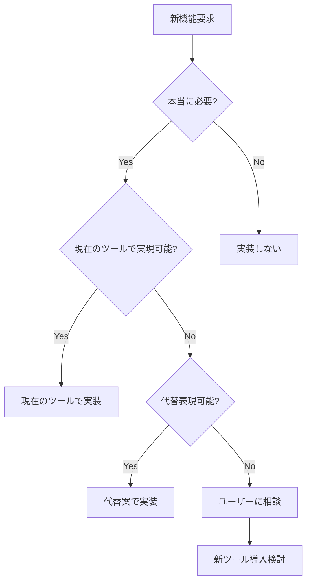

# FCO v2.1 Frontend実装戦略

## 📋 実装方針（2025-09-15決定）

### 🎯 基本原則
1. **枯れた技術優先**: 安定性とメンテナンス性を重視
2. **段階的複雑化**: シンプルに始めて必要に応じて拡張
3. **生成AI親和性**: Claude Codeが得意なツール選択
4. **シンプルさ重視**: 機能の必要性を常に検証

## 🛠️ 技術選択と段階的移行戦略

### 1. ルーティング
- **採用**: Next.js **Pages Router**
- **理由**: 枯れた技術、豊富なドキュメント、安定した動作
- **非採用**: App Router（新しすぎる、不要な複雑性）

### 2. UIテーマ
- **採用**: shadcn/ui **Dark theme**（黒系）
- **設定**: `dark`クラスをデフォルトに設定
- **カスタマイズ**: 必要最小限に留める

### 3. グラフライブラリ
```
初期実装: Recharts
↓
複雑な要件が発生した場合:
1. まず要件の必要性を検証
2. Rechartsでの代替表現を検討
3. 本当に必要な場合のみPlotly.jsを部分導入
```
- **判断基準**: 3D表示、高度なインタラクション、特殊な金融チャート
- **相談プロセス**: Plotly.js導入前に必ず要件確認

### 4. 状態管理
```
MVP: useState / useReducer
↓
状態が複雑化した場合:
1. 状態設計の見直し
2. 機能の必要性検証
3. 本当に必要ならZustand導入
```
- **目標**: 状態変数を最小限に保つ
- **判断基準**: 3つ以上のコンポーネント間での状態共有

### 5. データフェッチング
```
MVP: fetch API
↓
以下の場合にTanStack Query検討:
- 複数エンドポイントの並列取得
- キャッシュ戦略が複雑化
- リアルタイム更新が必要
```
- **初期実装**: シンプルなカスタムフック
- **エラーハンドリング**: 基本的なtry-catchで開始

### 6. TypeScript設定
```typescript
// tsconfig.json
{
  "compilerOptions": {
    "strict": true,              // ✅ 厳格な型チェック
    "noImplicitAny": true,       // 暗黙のany禁止
    "strictNullChecks": true,    // null/undefinedチェック
    "noUnusedLocals": true,      // 未使用変数の警告
    "noUnusedParameters": true   // 未使用パラメータの警告
  }
}
```
- **理由**: エディタのフィードバックを最大化、バグの早期発見

## 📁 プロジェクト構造

```
fco-dashboard-frontend/
├── pages/                     # Pages Router
│   ├── _app.tsx              # グローバル設定
│   ├── _document.tsx         # HTML構造
│   ├── index.tsx             # ホームページ
│   └── dashboard.tsx         # ダッシュボード
├── components/
│   ├── ui/                   # shadcn/ui (dark theme)
│   ├── charts/               # Recharts中心
│   └── layout/               # レイアウト
├── hooks/
│   └── useFCOData.ts         # fetch APIラッパー
├── lib/
│   └── api.ts                # API通信ロジック
└── styles/
    └── globals.css           # Tailwind + Dark theme
```

## 🚀 実装順序

### Phase 2-1: 基盤構築（現在）
1. Next.js Pages Router セットアップ
2. TypeScript strict設定
3. shadcn/ui dark theme導入
4. 基本レイアウト作成

### Phase 2-2: データ表示
1. fetch API でのデータ取得
2. Rechartsでの基本グラフ
3. useState での状態管理

### Phase 2-3: 機能拡張（必要に応じて）
1. 複雑な状態 → Zustand検討
2. 高度なグラフ → Plotly.js相談
3. キャッシュ → TanStack Query検討

## 📝 判断フローチャート



## ⚠️ 注意事項

1. **過度な最適化を避ける**: 問題が発生してから対処
2. **YAGNI原則**: "You Aren't Gonna Need It" - 今必要ないものは作らない
3. **段階的移行**: 一度に全てを変えない
4. **相談優先**: 不確実な場合は実装前に確認

## 🎯 成功指標

- **シンプルさ**: コードの行数が少ない
- **保守性**: 6ヶ月後の自分が理解できる
- **パフォーマンス**: 初期表示3秒以内
- **型安全性**: TypeScriptエラー0

---

**最終更新**: 2025-09-15
**承認**: ユーザー確認済み