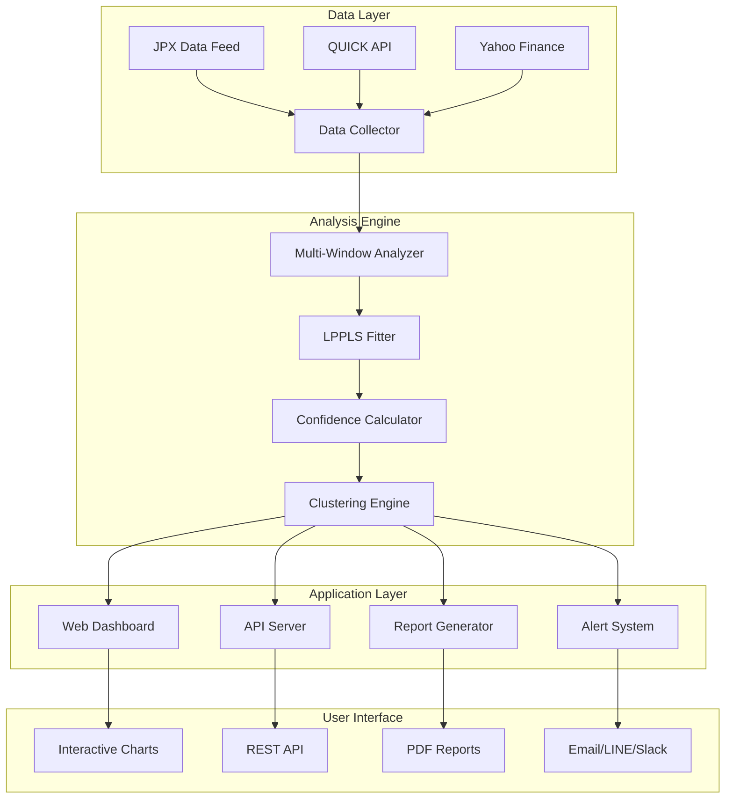
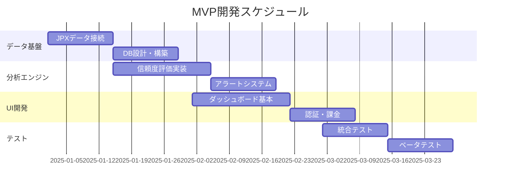
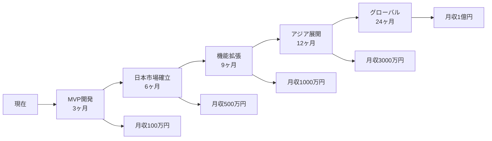

# LPPL金融市場クラッシュ予測サービス仕様書 v2.0
*FCO手法との差分分析と日本市場向けサービス展開計画*

## エグゼクティブサマリー

本文書は、ETH Zurich FCO（Financial Crisis Observatory）の実証済み手法と現在の実装を分析し、日本市場を起点としたグローバル展開可能なLPPLサービスの包括的仕様を定義する。

### 🎯 ビジョン
「FCOレベルの科学的精度」×「日本・アジア市場特化」×「インタラクティブUI」による独自ポジショニング

### 📊 ターゲット市場規模
- **日本国内**: 機関投資家約3,000社、個人投資家1,900万人
- **アジア市場**: 韓国、台湾、香港、シンガポールへの段階的展開
- **潜在収益**: 月額1億円（3年目標）

---

## 1. 現在の実装とFCO手法の技術的差分分析

### 1.1 コア技術の比較

| 機能領域 | FCO実装 | 現在の実装 | 差分・必要改善 |
|---------|---------|-----------|--------------|
| **LPPL数式** | 標準LPPLS 7パラメータ | 同等（論文式54準拠） | ✅ 同等実装済み |
| **フィッティング手法** | OLS + 非線形最適化 | curve_fit（scipy） | ⚠️ OLS前処理追加推奨 |
| **時間窓分析** | 3スケール複数窓（100-1500日） | 単一窓（365日デフォルト） | 🔴 **要実装** |
| **信頼性評価** | DS-LPPLS Confidence + Trust | R²、RMSE、品質評価 | 🔴 **要実装** |
| **クラスタリング** | k-means統計的統合 | DBSCAN時間軸クラスタ | ⚠️ 手法統合必要 |
| **複数初期値** | グリッドサーチ | 10初期値試行 | ✅ 基本実装済み |
| **レポート生成** | 月次PDF（20-30ページ） | Webダッシュボードのみ | 🔴 **要実装** |
| **更新頻度** | 月次 | リアルタイム可能 | ✅ **優位性** |
| **カバレッジ** | 1300資産（欧米中心） | 80資産 | 🔴 拡張必要 |

### 1.2 FCO独自指標の詳細

#### DS-LPPLS Confidence Indicator
```python
# FCO実装の概念（推定）
confidence = successful_fits / total_window_attempts
# 複数時間窓でのフィット成功率を統合評価
```

#### DS-LPPLS Trust Indicator
```python
# ブートストラップ法による統計的信頼性
trust = bootstrap_consistency_score(fitted_parameters, n_bootstrap=1000)
```

### 1.3 必須実装要素

1. **多重時間窓分析モジュール** ← 最優先
2. **DS-LPPLS指標算出システム**
3. **PDFレポート生成エンジン**
4. **k-meansクラスタリング統合**

---

## 2. 日本市場向けデータソース戦略

### 2.1 主要データプロバイダー

| プロバイダー | カバレッジ | API制限 | 月額費用 | 評価 |
|------------|-----------|---------|----------|------|
| **日本取引所グループ（JPX）** | 東証全銘柄、先物、オプション | 制限なし | 50万円〜 | ⭐⭐⭐⭐⭐ |
| **QUICK** | 日本株式、債券、為替 | 制限なし | 30万円〜 | ⭐⭐⭐⭐ |
| **Bloomberg Terminal** | グローバル全資産 | 制限なし | 200万円〜 | ⭐⭐⭐ |
| **Refinitiv Eikon** | グローバル全資産 | 制限なし | 100万円〜 | ⭐⭐⭐⭐ |
| **Yahoo Finance JP** | 日本株式（遅延） | 非公式API | 無料 | ⭐⭐ |
| **Alpha Vantage** | 日本株式（限定） | 500req/日 | 無料〜$250 | ⭐⭐ |
| **IEX Cloud** | 米国株中心 | 制限付き | $9〜$199 | ⭐⭐⭐ |
| **Quandl/Nasdaq Data** | マクロ経済データ | 制限付き | $99〜$2000 | ⭐⭐⭐ |

### 2.2 推奨データ構成（日本市場MVP）

```yaml
必須データ（Phase 1）:
  株式指数:
    - 日経225
    - TOPIX
    - マザーズ指数
    - JPX日経400
  
  個別株式:
    - 東証プライム上位100銘柄
    - 高流動性30銘柄
  
  為替:
    - USD/JPY
    - EUR/JPY
    - CNY/JPY
  
  債券:
    - 10年国債
    - 30年国債
    
  商品:
    - 金（東京商品取引所）
    - 原油（WTI連動）
    
  仮想通貨:
    - BTC/JPY
    - ETH/JPY

拡張データ（Phase 2）:
  - KOSPI（韓国）
  - TAIEX（台湾）
  - HSI（香港）
  - STI（シンガポール）
```

---

## 3. サービスアーキテクチャ設計

### 3.1 システム構成図



### 3.2 技術スタック

```yaml
Backend:
  言語: Python 3.11+
  フレームワーク: FastAPI
  LPPL実装: 
    - 既存core/fitting（ベース）
    - 新規multi_window_analyzer
    - 新規confidence_calculator
  
  データベース:
    - PostgreSQL（時系列データ）
    - Redis（キャッシュ）
    - InfluxDB（リアルタイムデータ）

Frontend:
  ダッシュボード: 
    - Streamlit（Phase 1）
    - React + D3.js（Phase 2）
  
  可視化:
    - Plotly（インタラクティブ）
    - Matplotlib（レポート用）

Infrastructure:
  クラウド: AWS東京リージョン
  CDN: CloudFront
  監視: Datadog
  CI/CD: GitHub Actions
```

---

## 4. 差別化機能の実装仕様

### 4.1 インタラクティブクラスタリング分析（独自機能）

現在実装済みの**Crash Prediction Clustering**を拡張し、FCOにない独自価値を提供：

```python
class InteractiveClusteringAnalyzer:
    """ユーザーがパラメータを調整しながら予測を探索できる"""
    
    def analyze(self, 
                symbol: str,
                distance_days: int = 45,  # ユーザー調整可能
                min_cluster_size: int = 3,  # ユーザー調整可能
                min_r2: float = 0.7):      # ユーザー調整可能
        
        # 1. 多重時間窓でLPPLフィッティング
        multi_window_results = self.fit_multiple_windows(symbol)
        
        # 2. DS-LPPLS指標計算
        confidence = self.calculate_confidence(multi_window_results)
        trust = self.calculate_trust(multi_window_results)
        
        # 3. インタラクティブクラスタリング
        clusters = self.interactive_clustering(
            multi_window_results, 
            distance_days, 
            min_cluster_size
        )
        
        # 4. 投資判断支援
        recommendations = self.generate_recommendations(
            clusters, confidence, trust
        )
        
        return {
            'clusters': clusters,
            'confidence': confidence,
            'trust': trust,
            'recommendations': recommendations
        }
```

### 4.2 日本語対応の教育コンテンツ

```yaml
教育コンテンツ構成:
  初級編:
    - LPPLモデルとは何か（5分動画）
    - バブルの数学的定義
    - 過去のクラッシュ事例
    
  中級編:
    - パラメータの意味と解釈
    - 信頼度指標の読み方
    - リスク管理への活用法
    
  上級編:
    - 数式の詳細解説
    - バックテスト結果の検証
    - APIを使った自動取引
```

### 4.3 LINE/Slack統合アラート

```python
class JapanMarketAlertSystem:
    """日本市場向けアラートシステム"""
    
    def send_alert(self, alert_level: str, message: str):
        if alert_level == "CRITICAL":
            # LINE Notify API
            self.line_notify(message, sticker_id="crash_warning")
            
            # Slack Webhook
            self.slack_webhook(message, color="danger")
            
            # Email（HTML形式）
            self.send_html_email(message, template="critical_alert")
```

---

## 5. 価格戦略とビジネスモデル

### 5.1 サブスクリプションプラン

| プラン | 月額料金 | 対象 | 機能 |
|--------|---------|------|------|
| **無料トライアル** | ¥0 | 全ユーザー | 3銘柄、2週間遅延、基本機能 |
| **個人スタンダード** | ¥9,800 | 個人投資家 | 20銘柄、日次更新、メールアラート |
| **個人プレミアム** | ¥29,800 | アクティブトレーダー | 50銘柄、リアルタイム、API(制限) |
| **プロフェッショナル** | ¥98,000 | セミプロ・小規模ファンド | 全銘柄、API無制限、優先サポート |
| **エンタープライズ** | ¥298,000〜 | 機関投資家 | カスタマイズ、専任サポート、SLA |

### 5.2 収益シミュレーション

```yaml
Year 1（MVP）:
  個人スタンダード: 100名 × ¥9,800 = ¥980,000/月
  個人プレミアム: 30名 × ¥29,800 = ¥894,000/月
  プロフェッショナル: 5社 × ¥98,000 = ¥490,000/月
  月間収益: ¥2,364,000
  
Year 2（成長期）:
  個人スタンダード: 500名 = ¥4,900,000/月
  個人プレミアム: 150名 = ¥4,470,000/月
  プロフェッショナル: 20社 = ¥1,960,000/月
  エンタープライズ: 3社 = ¥900,000/月
  月間収益: ¥12,230,000
  
Year 3（拡大期）:
  日本: ¥30,000,000/月
  韓国: ¥15,000,000/月
  その他アジア: ¥10,000,000/月
  月間収益: ¥55,000,000
```

---

## 6. 最小構成（MVP）定義

### 6.1 MVP機能要件

```yaml
必須機能（3ヶ月以内）:
  データ収集:
    - 日経225、TOPIX自動取得
    - 主要30銘柄の日次更新
    
  分析エンジン:
    - 単一時間窓LPPL（既存活用）
    - 基本的な信頼度評価
    - シンプルクラスタリング
    
  ユーザーインターフェース:
    - Streamlitダッシュボード
    - 基本的なチャート表示
    - CSVダウンロード機能
    
  アラート:
    - メール通知（閾値ベース）
    - 簡易レポート（週次）
    
  認証・課金:
    - 基本的なユーザー管理
    - Stripe決済統合
    - 使用量制限
```

### 6.2 MVP除外機能（将来実装）

```yaml
Phase 2以降:
  - 多重時間窓分析
  - DS-LPPLS Trust指標
  - PDFレポート生成
  - LINE/Slack連携
  - 英語・中国語対応
  - API提供
  - 機械学習強化
```

---

## 7. 技術実装ロードマップ

### Phase 1: MVP開発（Month 1-3）



### Phase 2: 機能拡張（Month 4-6）

```yaml
重点開発項目:
  1. 多重時間窓分析実装
     - 短期（100-200日）
     - 中期（200-500日）
     - 長期（500-1000日）
     
  2. DS-LPPLS指標
     - Confidence算出
     - Trust計算（ブートストラップ）
     
  3. レポート生成
     - PDFテンプレート設計
     - 自動生成スケジューラー
     
  4. 日本市場拡大
     - 東証プライム全銘柄対応
     - セクター別分析
```

### Phase 3: アジア展開（Month 7-12）

```yaml
展開計画:
  韓国市場:
    - KOSPI、KOSDAQ対応
    - 韓国語UI
    - ウォン決済
    
  台湾・香港:
    - TAIEX、HSI対応
    - 繁体字中国語
    
  東南アジア:
    - シンガポール（STI）
    - タイ（SET）
    - マレーシア（KLCI）
```

---

## 8. リスク分析と対策

### 8.1 技術的リスク

| リスク | 影響度 | 発生確率 | 対策 |
|--------|--------|----------|------|
| データ品質問題 | 高 | 中 | 複数ソースでのクロスバリデーション |
| 計算負荷増大 | 中 | 高 | 分散処理、キャッシング戦略 |
| 予測精度低下 | 高 | 中 | 継続的バックテスト、パラメータ調整 |
| API制限 | 低 | 高 | 複数プロバイダー併用、ローカルキャッシュ |

### 8.2 ビジネスリスク

| リスク | 影響度 | 発生確率 | 対策 |
|--------|--------|----------|------|
| 規制変更 | 高 | 低 | 法務アドバイザー、免責事項明記 |
| 競合参入 | 中 | 高 | 差別化機能強化、先行者利益確保 |
| 市場縮小 | 中 | 低 | グローバル展開、多様化 |
| 評判リスク | 高 | 中 | 透明性確保、教育コンテンツ充実 |

---

## 9. 成功指標（KPI）

### 9.1 ビジネスKPI

```yaml
3ヶ月目標:
  - 有料ユーザー: 50名
  - MRR: ¥1,000,000
  - チャーンレート: < 10%
  - NPS: > 30

6ヶ月目標:
  - 有料ユーザー: 200名
  - MRR: ¥3,000,000
  - チャーンレート: < 7%
  - API利用社数: 10社

12ヶ月目標:
  - 有料ユーザー: 1,000名
  - MRR: ¥10,000,000
  - チャーンレート: < 5%
  - 海外展開: 2カ国
```

### 9.2 技術KPI

```yaml
パフォーマンス:
  - 分析処理時間: < 5秒/銘柄
  - API応答時間: < 200ms (p95)
  - システム稼働率: > 99.9%
  
予測精度:
  - 偽陽性率: < 30%
  - バックテスト勝率: > 60%
  - シャープレシオ: > 1.5
```

---

## 10. アクションプラン（即実行）

### Week 1-2: 基盤構築
```bash
# 1. 開発環境セットアップ
- AWS東京リージョンでインフラ構築
- PostgreSQL/Redis/InfluxDBセットアップ
- CI/CDパイプライン設定

# 2. データ接続確立
- Yahoo Finance JP APIテスト
- JPX資料請求・契約準備
- データ取得スクリプト作成
```

### Week 3-4: コア機能実装
```python
# 1. 多重時間窓分析
class MultiWindowAnalyzer:
    def __init__(self):
        self.windows = [
            (100, 200),  # Super Short
            (150, 300),  # Short
            (500, 1000)  # Long
        ]
    
    def analyze_all_windows(self, symbol: str):
        results = []
        for min_days, max_days in self.windows:
            # 各時間窓で分析実行
            result = self.analyze_window(
                symbol, min_days, max_days
            )
            results.append(result)
        return self.integrate_results(results)

# 2. 信頼度評価システム
class ConfidenceCalculator:
    def calculate_ds_lppls_confidence(self, results):
        successful = sum(1 for r in results if r['converged'])
        total = len(results)
        return successful / total if total > 0 else 0
```

### Week 5-6: UI/UX開発
```yaml
実装項目:
  1. Streamlitダッシュボード拡張
     - 日本語UI完全対応
     - モバイルレスポンシブ
     
  2. 認証システム
     - Auth0統合
     - 役割ベースアクセス制御
     
  3. 決済統合
     - Stripe Billing設定
     - 使用量追跡
```

---

## 11. 競合優位性の確立

### 11.1 FCOとの差別化

| 要素 | FCO | 本サービス | 優位性 |
|------|-----|------------|--------|
| 更新頻度 | 月次 | リアルタイム〜日次 | ⭐⭐⭐⭐⭐ |
| インタラクティブ性 | PDFレポートのみ | 動的ダッシュボード | ⭐⭐⭐⭐⭐ |
| アジア市場 | 限定的 | 専門特化 | ⭐⭐⭐⭐⭐ |
| 価格 | 無料（研究用） | 段階的有料 | ⭐⭐⭐ |
| API提供 | なし | あり | ⭐⭐⭐⭐⭐ |
| 言語対応 | 英語のみ | 日英中韓 | ⭐⭐⭐⭐ |

### 11.2 持続的競争優位の源泉

1. **データの独自性**: 日本市場の高頻度データ蓄積
2. **アルゴリズムの進化**: 機械学習による継続的改善
3. **ネットワーク効果**: ユーザーコミュニティ形成
4. **ブランド構築**: 「アジア市場のLPPL権威」ポジション

---

## 12. 結論と次のステップ

### 12.1 実現可能性評価

```yaml
技術的実現可能性: ⭐⭐⭐⭐ (高)
  - コア技術は実装済み
  - 必要な拡張は明確
  - 3ヶ月でMVP可能

市場適合性: ⭐⭐⭐⭐⭐ (非常に高)
  - アジア市場に競合なし
  - 明確なニーズ存在
  - 価格競争力あり

収益性: ⭐⭐⭐⭐ (高)
  - 低い限界費用
  - 高いLTV/CAC比率
  - スケーラブル

リスク: ⭐⭐⭐ (中)
  - 規制リスクは管理可能
  - 技術的リスクは低い
  - 市場教育が必要
```

### 12.2 即時実行事項

1. **今週中**
   - JPXデータフィード申請開始
   - AWS環境構築
   - ランディングページ公開

2. **2週間以内**
   - ベータユーザー10名募集
   - 多重時間窓分析プロトタイプ
   - Stripe決済テスト環境

3. **1ヶ月以内**
   - MVP α版リリース
   - 日経225完全対応
   - 週次レポート生成開始

### 12.3 成功への道筋



---

*本仕様書は、FCOの実証済み手法を基盤としつつ、日本・アジア市場向けの独自価値を付加した実装可能なサービス設計である。継続的な改善とユーザーフィードバックの反映により、3年以内にアジア最大のLPPL予測サービスとなることを目指す。*

**作成日**: 2025年1月
**バージョン**: 2.0
**次回更新**: MVP完成時（2025年4月予定）